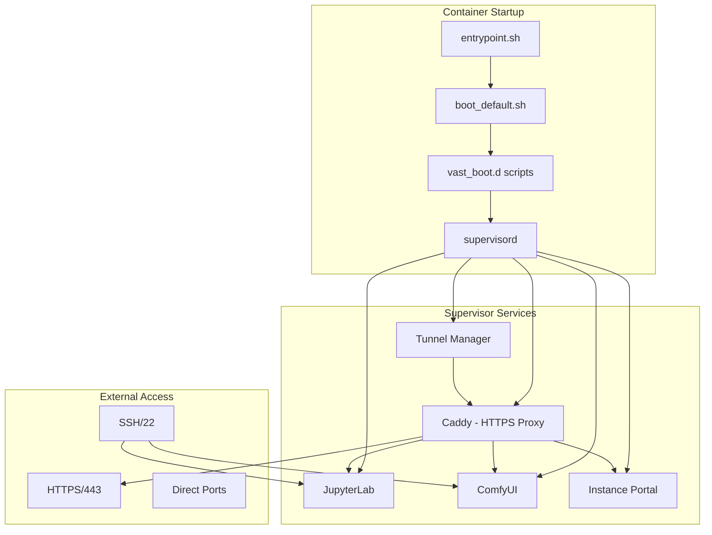

# Custom Docker Image: JupyterLab + ComfyUI + SSH for Vast.ai

This custom Docker image provides a complete AI development environment for [Vast.ai](https://vast.ai) GPU cloud with:

- **JupyterLab**: Interactive notebook development environment
- **ComfyUI**: Node-based Stable Diffusion interface with Manager and essential nodes
- **SSH Access**: Secure key-based SSH access for remote development
- **Full Vast.ai Compatibility**: Platform-specific tools for HTTPS, tunnels, and web UI
- **Cloud CLI Tools**: AWS CLI and Hetzner CLI for cloud management

## Target Platform

This image is built exclusively for **linux/amd64** architecture.

## Base Image

Built from scratch using `nvidia/cuda:13.0.2-cudnn-runtime-ubuntu24.04` with:
- CUDA 13.0.2 with cuDNN runtime
- Ubuntu 24.04 LTS
- Python 3.12 virtual environment

---

## Architecture Overview

### File Structure Diagram

```mermaid
graph TB
    subgraph "Build Context"
        Dockerfile[Dockerfile]
        ROOT[ROOT/]
        PORTAL[portal-aio/]
    end
    
    subgraph "ROOT Directory"
        ROOT --> ETC[etc/]
        ROOT --> OPT[opt/]
        
        ETC --> SUPERVISOR[supervisor/conf.d/]
        ETC --> VASTBOOT[vast_boot.d/]
        
        SUPERVISOR --> CADDY_CONF[caddy.conf]
        SUPERVISOR --> JUPYTER_CONF[jupyter.conf]
        SUPERVISOR --> COMFYUI_CONF[comfyui.conf]
        SUPERVISOR --> PORTAL_CONF[instance_portal.conf]
        SUPERVISOR --> TUNNEL_CONF[tunnel_manager.conf]
        
        VASTBOOT --> BOOT10[10-prep-env.sh]
        VASTBOOT --> BOOT35[35-sync-home-dirs.sh]
        VASTBOOT --> BOOT36[36-sync-workspace.sh]
        VASTBOOT --> BOOT65[65-supervisor-launch.sh]
        VASTBOOT --> BOOT75[75-provisioning-script.sh]
        
        OPT --> INSTANCE_TOOLS[instance-tools/bin/]
        OPT --> SUPERVISOR_SCRIPTS[supervisor-scripts/]
        
        INSTANCE_TOOLS --> ENTRYPOINT[entrypoint.sh]
        INSTANCE_TOOLS --> BOOT_DEFAULT[boot_default.sh]
        
        SUPERVISOR_SCRIPTS --> CADDY_SH[caddy.sh]
        SUPERVISOR_SCRIPTS --> JUPYTER_SH[jupyter.sh]
        SUPERVISOR_SCRIPTS --> COMFYUI_SH[comfyui.sh]
    end
    
    subgraph "portal-aio Directory"
        PORTAL --> CADDY_MGR[caddy_manager/]
        PORTAL --> TUNNEL_MGR[tunnel_manager/]
        PORTAL --> PORTAL_APP[portal/]
        PORTAL --> REQUIREMENTS[requirements.txt]
    end
```



### Service Dependencies Diagram



### Build Process Diagram

```mermaid
flowchart LR
    subgraph "Multi-Stage Build"
        UV[Stage 1: uv binary]
        CADDY_BUILD[Stage 2: Caddy build]
        MAIN[Stage 3: Main image]
    end
    
    subgraph "Stage 1"
        UV_IMAGE[ghcr.io/astral-sh/uv:latest]
        UV_BIN[/uv, /uvx binaries]
        UV_IMAGE --> UV_BIN
    end
    
    subgraph "Stage 2"
        GO_IMAGE[golang:1.23.4-bookworm]
        XCADDY[xcaddy build]
        CADDY_BIN[caddy binary]
        GO_IMAGE --> XCADDY --> CADDY_BIN
    end
    
    subgraph "Stage 3"
        CUDA_IMAGE[nvidia/cuda:13.0.2-cudnn-runtime-ubuntu24.04]
        APT[apt packages + SSH]
        PYTHON[Python venv + deps]
        COMFYUI_INSTALL[ComfyUI + Manager]
        TOOLS[AWS CLI + Hetzner CLI]
        CONFIG[ROOT/ configs]
        
        CUDA_IMAGE --> APT
        APT --> PYTHON
        PYTHON --> COMFYUI_INSTALL
        COMFYUI_INSTALL --> TOOLS
        TOOLS --> CONFIG
    end
    
    UV_BIN --> MAIN
    CADDY_BIN --> MAIN
```

---

## Key Features

### Package Management
- **uv**: Fast Python package manager (installed via multi-stage build from distroless image)
- Pre-configured virtual environment at `/venv/main`

### Deep Learning Stack
- PyTorch with CUDA support
- TensorRT for inference optimization
- Transformers, Accelerate, and other AI libraries

### Web Services
- **Caddy**: Reverse proxy with automatic TLS (built with TLS redirect support)
- **Cloudflared**: Cloudflare tunnel support for secure external access

### Development Tools
- JupyterLab with ipykernel support
- TensorBoard for training visualization
- Hugging Face CLI for model management
- Git LFS for large file handling

### Cloud CLI Tools
- **AWS CLI**: Amazon Web Services command-line interface
- **Hetzner CLI**: Hetzner Cloud command-line interface (`hcloud`)

---

## Building the Image

### Using Docker

```bash
# Navigate to the comfyui-jupyter-ssh directory
cd derivatives/comfyui-jupyter-ssh

# Build for amd64
docker buildx build --platform linux/amd64 -t comfyui-jupyter-ssh:latest .

# Build with specific ComfyUI version
docker buildx build --platform linux/amd64 \
    --build-arg COMFYUI_REF=v0.3.0 \
    -t comfyui-jupyter-ssh:v0.3.0 .

# Build with custom Python version
docker buildx build --platform linux/amd64 \
    --build-arg PYTHON_VERSION=3.11 \
    -t comfyui-jupyter-ssh:py311 .
```

### Using Podman

```bash
# Navigate to the comfyui-jupyter-ssh directory
cd derivatives/comfyui-jupyter-ssh

# Build for amd64
podman build --platform linux/amd64 -t comfyui-jupyter-ssh:latest .

# Build with specific ComfyUI version
podman build --platform linux/amd64 \
    --build-arg COMFYUI_REF=v0.3.0 \
    -t comfyui-jupyter-ssh:v0.3.0 .
```

### Publishing to GitHub Container Registry (GHCR)

```bash
# Login to GHCR
echo $GITHUB_TOKEN | docker login ghcr.io -u USERNAME --password-stdin

# Tag the image
docker tag comfyui-jupyter-ssh:latest ghcr.io/USERNAME/comfyui-jupyter-ssh:latest

# Push to GHCR
docker push ghcr.io/USERNAME/comfyui-jupyter-ssh:latest
```

### Publishing to Docker Hub

```bash
# Login to Docker Hub
docker login -u USERNAME

# Tag the image
docker tag comfyui-jupyter-ssh:latest USERNAME/comfyui-jupyter-ssh:latest

# Push to Docker Hub
docker push USERNAME/comfyui-jupyter-ssh:latest
```

---

## Build Arguments

| Argument | Default | Description |
|----------|---------|-------------|
| `PYTHON_VERSION` | `3.12` | Python version for the main virtual environment |
| `COMFYUI_REF` | `master` | ComfyUI git ref (branch, tag, or commit) |

---

## Directory Structure & Important Paths

```
Container Filesystem:
├── /workspace/                 # Main workspace (mounted volume on vast.ai)
│   └── ComfyUI/               # ComfyUI installation (synced from /opt/workspace-internal)
│       ├── models/            # Model files
│       │   ├── checkpoints/   # Stable Diffusion models
│       │   ├── loras/         # LoRA models
│       │   ├── controlnet/    # ControlNet models
│       │   └── vae/           # VAE models
│       ├── custom_nodes/      # Custom nodes
│       │   ├── ComfyUI-Manager/   # Official ComfyUI Manager
│       │   └── ComfyUI_essentials/ # Essential utility nodes
│       └── output/            # Generated images
├── /opt/workspace-internal/   # Internal workspace (build-time)
│   └── ComfyUI/              # ComfyUI source (copied to /workspace on boot)
├── /venv/main/               # Main Python virtual environment
├── /opt/portal-aio/          # Vast.ai portal web app
│   ├── caddy_manager/        # Caddy configuration manager
│   ├── tunnel_manager/       # Cloudflare tunnel manager
│   └── portal/               # Instance Portal web UI
├── /opt/instance-tools/bin/  # Instance management tools
│   ├── entrypoint.sh         # Container entrypoint
│   ├── boot_default.sh       # Default boot script
│   ├── caddy                 # Caddy binary (symlink)
│   └── cloudflared           # Cloudflared binary (symlink)
├── /etc/supervisor/conf.d/   # Supervisor service configurations
├── /etc/vast_boot.d/         # Vast.ai boot scripts (executed in order)
└── /ComfyUI -> /opt/workspace-internal/ComfyUI  # Convenience symlink
```

---

## How It Works

### Container Startup Sequence

1. **Entrypoint** (`/opt/instance-tools/bin/entrypoint.sh`)
   - Checks for custom boot script
   - Falls back to default boot script

2. **Boot Script** (`/opt/instance-tools/bin/boot_default.sh`)
   - Sources all scripts in `/etc/vast_boot.d/` in order
   - Handles SSH key propagation, workspace sync, environment setup

3. **Boot Scripts** (`/etc/vast_boot.d/*.sh`)
   - `10-prep-env.sh`: Prepares environment variables
   - `35-sync-home-dirs.sh`: Syncs home directories to workspace
   - `36-sync-workspace.sh`: Syncs workspace-internal to workspace
   - `55-tls-cert-gen.sh`: Generates TLS certificates
   - `65-supervisor-launch.sh`: Starts supervisord
   - `75-provisioning-script.sh`: Runs user provisioning script

4. **Supervisor** starts all services:
   - Caddy (HTTPS reverse proxy)
   - JupyterLab
   - ComfyUI
   - Instance Portal
   - Tunnel Manager

### Service Communication

- **Caddy** acts as the main reverse proxy, handling HTTPS and routing
- **Instance Portal** provides the web UI for managing the instance
- **Tunnel Manager** creates Cloudflare tunnels for external access
- **JupyterLab** runs on port 18080 (proxied through Caddy)
- **ComfyUI** runs on port 18188 (proxied through Caddy)

---

## Vast.ai Compatibility

This image is designed for full compatibility with Vast.ai's platform. It follows the official [Vast.ai Docker documentation](https://docs.vast.ai/documentation/instances/templates/docker-environment):

### SSH Access
- SSH server configured with key-based authentication only
- Vast.ai injects SSH keys automatically on instance creation
- Supports both root and user accounts
- Reference: [Vast.ai SSH Documentation](https://docs.vast.ai/documentation/instances/connect/ssh)

### Jupyter Access
- JupyterLab available through Caddy proxy with authentication
- Direct access via SSH tunnel supported
- Compatible with Vast.ai's Jupyter launch mode
- Reference: [Vast.ai Jupyter Documentation](https://docs.vast.ai/documentation/instances/connect/jupyter)

### Environment Variables
The following vast.ai environment variables are supported:

| Variable | Description |
|----------|-------------|
| `WORKSPACE` | Working directory (default: `/workspace`) |
| `DATA_DIRECTORY` | Data directory (same as WORKSPACE) |
| `COMFYUI_ARGS` | Additional ComfyUI arguments |
| `PROVISIONING_SCRIPT` | URL to custom provisioning script |
| `ENABLE_HTTPS` | Enable HTTPS via Caddy (`true`/`false`) |
| `WEB_PASSWORD` | Web interface password |
| `PORTAL_CONFIG` | Portal configuration string |

---

## Using on Vast.ai

### Creating a Template

1. Push the built image to a container registry (Docker Hub, GHCR, etc.)
2. In Vast.ai, create a new template with your image
3. Configure port mappings:
   - Port 8080: JupyterLab (via Caddy proxy)
   - Port 8188: ComfyUI (internal port 18188)
   - Port 22: SSH access

### SSH Access

SSH access uses key-based authentication only. Configure your SSH key in the Vast.ai dashboard:

```bash
ssh root@INSTANCE_IP -p SSH_PORT
```

For SSH tunneling to services:

```bash
# JupyterLab via SSH tunnel
ssh root@INSTANCE_IP -p SSH_PORT -L 8888:localhost:18080

# ComfyUI via SSH tunnel
ssh root@INSTANCE_IP -p SSH_PORT -L 8188:localhost:18188
```

---

## Pre-installed Custom Nodes

- **ComfyUI-Manager**: Official node management and installation (from Comfy-Org)
- **ComfyUI_essentials**: Essential utility nodes

---

## Services (Supervisor)

The following services are managed by Supervisor:

| Service | Port | Description |
|---------|------|-------------|
| caddy | Various | HTTPS reverse proxy |
| jupyter | 18080 | JupyterLab server |
| comfyui | 18188 | ComfyUI server |
| tunnel_manager | 11112 | Cloudflare tunnel manager |
| instance_portal | 1111 | Vast.ai instance portal |

---

## Customization

### Adding Models

Models can be added to `/workspace/ComfyUI/models/` subdirectories:
- `checkpoints/` - Stable Diffusion models
- `loras/` - LoRA models
- `controlnet/` - ControlNet models
- `vae/` - VAE models

### Adding Custom Nodes

1. SSH into the instance
2. Navigate to `/workspace/ComfyUI/custom_nodes/`
3. Clone the custom node repository
4. Restart the ComfyUI service: `supervisorctl restart comfyui`

### Provisioning Script

Use the `PROVISIONING_SCRIPT` environment variable to run a custom setup script on first boot:

```bash
export PROVISIONING_SCRIPT=https://example.com/my-setup.sh
```

---

## License

This image is built for use with Vast.ai. See individual component licenses:
- NVIDIA CUDA: NVIDIA proprietary license
- ComfyUI: GPL-3.0
- JupyterLab: BSD-3-Clause
- PyTorch: BSD-3-Clause
- AWS CLI: Apache-2.0
- Hetzner CLI: MIT
